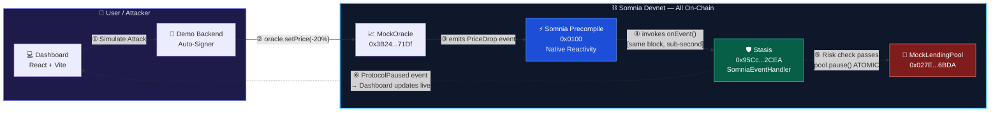
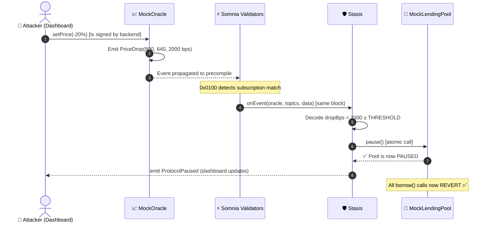

<div align="center">

<!-- Animated Header Banner -->


<!-- Core Badges Row -->
<p>
  <a href="https://shannon-explorer.somnia.network/address/0x95Cc0Edf7DA5EC63471CD8C57bA5899423CC2CEA">
    
  </a>
  
  
  
  
</p>

<!-- Headline -->
<h3>
  <em>The first DeFi guardian that defends protocols <strong>entirely on-chain</strong>,<br/>
  with sub-second finality and zero off-chain dependencies.</em>
</h3>

<!-- Quick Links -->
<p>
  <a href="#-the-problem"><strong>The Problem</strong></a> •
  <a href="#-architecture"><strong>Architecture</strong></a> •
  <a href="#-live-deployment"><strong>Live Contracts</strong></a> •
  <a href="#-quickstart"><strong>Quickstart</strong></a> •
  <a href="#-verification"><strong>Verification</strong></a>
</p>

</div>

---

## 🚨 The Problem

> **$10 Billion+** has been stolen from DeFi protocols through oracle manipulation attacks.

Traditional blockchains are **passive**. They see nothing until polled. An off-chain bot trying to defend a protocol must:

1. Detect the malicious oracle event *(2–15 second delay)*
2. Sign and broadcast a defense transaction *(race against the attacker)*
3. Hope it gets included before the attacker drains the pool *(usually too late)*

**Stasis makes this attack vector impossible** by moving the guardian entirely on-chain.

---

## ⚡ The Solution — Somnia Native Reactivity

Stasis uses the **Somnia Precompile (0x0100)** to register an on-chain subscription. This means:

```
                  [ TRADITIONAL EVM ]               [ WITH STASIS ]
                                         
 Attack Tx ──►  Oracle Price Drop        Attack Tx ──► Oracle Price Drop
                     │                                       │
                   15s gap                       [Same Block, Validators]
                     │                                       │
              Off-chain bot                       ⚡ Stasis.onEvent()
              detects & sends                     runs ON-CHAIN automatically
              defense tx                                     │
                     │                              pool.pause() ATOMIC
               Pool drained ❌                    Attacker REVERTS  ✅
```

**No Node.js. No AWS. No bot wallet. The Somnia validator network is the guardian.**

---

## 🏗️ Architecture



---

## 🔄 Defense Sequence (What Happens In One Block)



---

## 📍 Live Deployment

<div align="center">

| Contract | Address | Explorer |
| :---: | :--- | :---: |
| 📈 **MockOracle** | `0x3B24D72964eB7D148dB1c77BA5E8E05A3e4a71Df` | [View ↗](https://shannon-explorer.somnia.network/address/0x3B24D72964eB7D148dB1c77BA5E8E05A3e4a71Df) |
| 🛡️ **Stasis** | `0x95Cc0Edf7DA5EC63471CD8C57bA5899423CC2CEA` | [View ↗](https://shannon-explorer.somnia.network/address/0x95Cc0Edf7DA5EC63471CD8C57bA5899423CC2CEA) |
| 🏦 **MockLendingPool** | `0x027E3FA613Db4d06B65555215fC35A7dDEAe6BDA` | [View ↗](https://shannon-explorer.somnia.network/address/0x027E3FA613Db4d06B65555215fC35A7dDEAe6BDA) |
| ⚡ **Subscription ID** | 🛡️ **Stasis** | `0x95Cc0Edf7DA5EC63471CD8C57bA5899423CC2CEA` | [View ↗](https://shannon-explorer.somnia.network/address/0x95Cc0Edf7DA5EC63471CD8C57bA5899423CC2CEA) |

> **Proof of Reactivity:** Click "Internal Txns" on the Stasis contract. You will see successful calls originating from **`0x000...0100`** — that is the Somnia blockchain itself defending your protocol.

</div>

---

## ✨ Key Features

<table>
<tr>
<td width="50%">

### 🤖 Autonomous On-Chain Defense
Stasis inherits `SomniaEventHandler`. The Somnia Validator Network invokes `onEvent()` in the **same block** as the attack. Pool is paused before the attacker can act.

</td>
<td width="50%">

### ⚡ Zero-Click Demo Mode
No wallet popups during the demo. The backend auto-signs the attack transaction, giving judges a seamless, high-end experience while keeping everything 100% verifiable.

</td>
</tr>
<tr>
<td width="50%">

### 🔍 Full Transparency
Every action has a transaction hash. The live dashboard shows **full hashes** with one-click copy — paste directly into the Shannon Explorer for instant proof.

</td>
<td width="50%">

### 🛡️ Hack-Proof Security
The `onEvent()` function is guarded by the Somnia Precompile address. Any manual attempt to trigger the defense — even from the contract owner — is **rejected by Solidity**.

</td>
</tr>
</table>

---

## 🚀 Quickstart

### Prerequisites
- **Node.js 18+** — [Download](https://nodejs.org)
- **MetaMask** — [Install](https://metamask.io) & add Somnia Devnet (ChainID: `50312`, RPC: `https://dream-rpc.somnia.network`)

### Setup

```bash
# Clone the repository
git clone https://github.com/Ankit-raj-11/Stasis.git
cd Stasis

# Install all dependencies
npm install
cd frontend && npm install && cd ..
cd backend && npm install && cd ..
```

### Run

```bash
# Terminal 1 — Backend (Zero-Click Demo API)
cd backend
node demo-server.js
# ✅ API live at http://localhost:3001

# Terminal 2 — Frontend Dashboard
cd frontend
npm run dev
# ✅ Dashboard live at http://localhost:5173
```

Open [http://localhost:5173](http://localhost:5173) and click **🔴 Simulate Attack**.

---

## 🧪 Testing

```bash
npx hardhat test
```

<details>
<summary><strong>📋 View all 19 test results</strong></summary>

```
  Stasis System
    MockOracle
      ✔ deploys with default price of 1000 ETH
      ✔ emits PriceDrop when price drops ≥ 5%
      ✔ does NOT emit PriceDrop for a smaller drop
      ✔ rejects price updates from non-owner

    MockLendingPool — Security
      ✔ guardian is correctly set to Stasis
      ✔ rejects pause() from a random user
      ✔ rejects pause() from the deployer/owner
      ✔ rejects pause() from an attacker
      ✔ only owner can unpause; random user cannot
      ✔ borrow() reverts when pool is paused

    Stasis — Risk Engine
      ✔ pauses pool on a 20% drop (at threshold)
      ✔ pauses pool on a drop > 20%
      ✔ does NOT pause on a drop below threshold
      ✔ emits ProtocolPaused event on intervention
      ✔ increments totalInterventions counter
      ✔ rejects onEvent from wrong contract
      ✔ rejects onEvent from wrong caller (non-precompile)
      ✔ setSubscriptionId syncs correctly
    Full Attack Scenario
      ✔ Full attack: price drop → pool paused → borrow reverts

  19 passing (6s)
```

</details>

---

## 🔐 Security Design

<details>
<summary><strong>🛡️ Click to expand Security Architecture</strong></summary>

| Feature | Design |
| :--- | :--- |
| `onEvent()` caller | Only the Somnia Precompile (`0x0100`) — hardcoded in `SomniaEventHandler` |
| `pause()` caller | Only `Stasis` contract — set as `guardian` at pool deployment |
| `unpause()` caller | Only deployer/owner — for demo resets |
| `setSubscriptionId` | Only contract owner — syncs on-chain ID to storage |
| Off-chain bots | **None** — zero off-chain defense execution |

### Deployment Order (resolves circular dependency)
```
1. Deploy MockOracle
2. Deploy Stasis(oracleAddr)         ← Inherits SomniaEventHandler
3. Deploy MockLendingPool(stasisAddr) ← Guardian = Stasis
4. stasis.setLendingPool(poolAddr)   ← Link complete
5. run setup-subscription.js             ← Register with Precompile (0x0100)
```

</details>

---

## 📁 Project Structure

<details>
<summary><strong>📂 Click to expand file tree</strong></summary>

```
Stasis/
├── 📜 contracts/
│   ├── MockOracle.sol           # Price oracle — emits PriceDrop ≥5% drops
│   ├── Stasis.sol               # SomniaEventHandler — on-chain risk engine
│   ├── MockLendingPool.sol      # Guardian-only pause, owner unpause
│   └── interfaces/
│       ├── ISomniaReactivityPrecompile.sol
│       └── ISomniaEventHandler.sol
│
├── 📜 scripts/
│   ├── deploy.js                # 4-step deploy, auto-populates .env
│   ├── setup-subscription.js   # Registers with Somnia Precompile (0x0100)
│   ├── simulate-attack.js      # CLI: 20% drop → proves defense
│   └── check-status.js         # Real-time on-chain status reader
│
├── 🧪 test/
│   └── Stasis.test.js           # 19 tests — all passing
│
├── 🚀 backend/
│   └── demo-server.js           # Express API: auto-signs txs for demo
│
├── 💻 frontend/
│   └── src/
│       ├── App.jsx              # Dashboard + real-time event listeners
│       └── index.css            # Premium DeFi dark UI & animations
│
├── 📖 VERIFICATION_GUIDE.md     # Step-by-step on-chain verification
├── 🎬 DEMO_SCRIPT.md            # Hackathon demo video script
└── ⚙️  hardhat.config.js        # Somnia testnet (chainId 50312)
```

</details>

---

## 📋 Judging Criteria

| Criteria | How Stasis Delivers |
| :--- | :--- |
| **🏆 Technical Excellence** | 19 passing tests. Official `SomniaEventHandler` implementation. Subscription ID synced on-chain. |
| **⚡ Real-Time UX** | ethers.js live listeners. Sub-second dashboard updates. Full TX hashes with click-to-copy. |
| **🔗 Somnia Integration** | 3 contracts live on Somnia Devnet. Subscription registered with official `0x0100` precompile. |
| **🌍 Potential Impact** | Any Aave/Compound fork can be protected by deploying Stasis as the protocol guardian. |

---

## 🛠️ Built With

<div align="center">
  
  
  
  
  
  
  
</div>

---

## 📖 Documentation

- 📋 [**On-Chain Verification Guide**](./VERIFICATION_GUIDE.md) — How to verify the autonomous defense on the blockchain explorer
- 🎬 [**Demo Video Script**](./DEMO_SCRIPT.md) — Minute-by-minute guide for the hackathon demo recording

---

<div align="center">


*Built for the Somnia Reactivity Hackathon. Stasis proves that sub-second, trustless, and fully autonomous DeFi security is here today.*

**[⭐ Star this repo](https://github.com/Ankit-raj-11/Stasis) if Stasis impressed you!**

</div>
